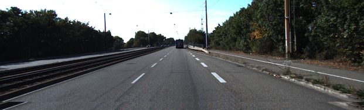
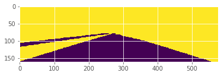
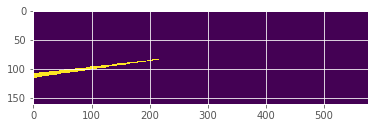
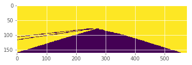
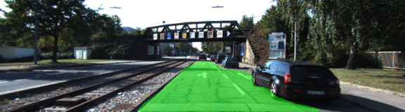

# Semantic Segmentation Project

In this project, I labeled the pixels of a road in images using a Fully Convolutional Network (FCN).

## Project Overview
The input image is like the first image and the labeled image is like the second one.
With the labeled images, I built a model to detect roads.




As default, `gen_batch_function` in `helper.py` tries to remove background except for roads.
A masked image possibly includes opposite side roads.
I modified `gen_batch_function` to solve the issue.

When removing purely red collar from a labeled image.
We get something like below.


To remove the noisy labels, I also remove purely black collar from a labeled image.
As a result


Getting an union of the red mask and the black mask, we can extract the road we want as much as possible.


## Result
The following images are samples of the results of my trained model.
You can see other images in `./images/results/`




## Implementation write-up
### How to load a saved modele

In `load_vgg` function, it loads a trained model of VGG16 with `tf.saved.model.loader.load()`.
Moreover, it extracts tensors `get_tensor_by_name()` of tensorflow's graph.

```
def load_vgg(sess, vgg_path):
  ...

  tf.saved_model.loader.load(sess, [vgg_tag], vgg_path)
  graph = tf.get_default_graph()
  input_image = graph.get_tensor_by_name(vgg_input_tensor_name)
  keep_prob = graph.get_tensor_by_name(vgg_keep_prob_tensor_name)
  vgg_layer3_out = graph.get_tensor_by_name(vgg_layer3_out_tensor_name)
  vgg_layer4_out = graph.get_tensor_by_name(vgg_layer4_out_tensor_name)
  vgg_layer7_out = graph.get_tensor_by_name(vgg_layer7_out_tensor_name)

  return input_image, keep_prob, vgg_layer3_out, vgg_layer4_out, vgg_layer7_out
```

### How to construct layers

Following the way in "Fully Convolutional Networks for Semantic Segmentation", `layers` function constructs "encoding" layers.
First, it passes a 1x1 convolutional layer with `vgg_layer7_out` and then does upsamling it with `conv2d_transpose` on 4x4 window size and 2x2 sliding size.
Second, it passes a 1x1 convolutional layer with `vgg_layer4_out` too and then adds it to the upsampled layer above.
After that, it does upsampling the concatenated layer with 4x4 window size and 2x2 sliding size.
Third, it passes a 1x1 convolutional layer with `vgg_lwyer3_out` and then adds it to the upsampled layer in the second phase, and next does upsampling with 16x16 window size and 8x8 sliding size

```
def layers(vgg_layer3_out, vgg_layer4_out, vgg_layer7_out, num_classes):
    # 1x1 convolution on vgg_layer7_out
    conv_layer7 = tf.layers.conv2d(vgg_layer7_out, num_classes, 1, 1, padding='same',
                                   kernel_initializer= tf.random_normal_initializer(stddev=1e-2),
                                   kernel_regularizer=tf.contrib.layers.l2_regularizer(1e-3))
    # upsampling
    upsampled1 = tf.layers.conv2d_transpose(conv_layer7, num_classes, 4, 2, padding='same',
                                            kernel_initializer= tf.random_normal_initializer(stddev=1e-2),
                                            kernel_regularizer=tf.contrib.layers.l2_regularizer(1e-3))

    # 1x1 convolution on vgg_layer4_out
    conv_layer4 = tf.layers.conv2d(vgg_layer4_out, num_classes, 1, 1, padding='same',
                                   kernel_initializer= tf.random_normal_initializer(stddev=1e-2),
                                   kernel_regularizer=tf.contrib.layers.l2_regularizer(1e-3))
    # skip connection
    skip_connection2 = tf.add(upsampled1, conv_layer4)
    # upsampling
    upsampled2 = tf.layers.conv2d_transpose(skip_connection2, num_classes, 4, 2, padding='same',
                                            kernel_initializer= tf.random_normal_initializer(stddev=1e-2),
                                            kernel_regularizer=tf.contrib.layers.l2_regularizer(1e-3))

    # 1x1 convolution on vgg_layer3_out
    conv_layer3 = tf.layers.conv2d(vgg_layer3_out, num_classes, 1, 1, padding='same',
                                   kernel_initializer= tf.random_normal_initializer(stddev=1e-2),
                                   kernel_regularizer=tf.contrib.layers.l2_regularizer(1e-3))
    # skip connection
    skip_connection3 = tf.add(upsampled2, conv_layer3)
    # upsampling
    nn_last_layer = tf.layers.conv2d_transpose(skip_connection3, num_classes, 16, 8, padding='same',
                                               kernel_initializer= tf.random_normal_initializer(stddev=1e-2),
                                               kernel_regularizer=tf.contrib.layers.l2_regularizer(1e-3),
                                               name='nn_last_layer')
    return nn_last_layer
```

### How to optimize
`optimize` function defines a loss function which measures a pixcel-based image comparison.
As well as it defines optimizer that I used `AdamOptimizer` here.

```
def optimize(nn_last_layer, correct_label, learning_rate, num_classes):
    # define loss function
    logits = tf.reshape(nn_last_layer, (-1, num_classes), name='logits')
    labels = tf.reshape(correct_label, (-1, num_classes), name='labels')
    cross_entropy_loss = tf.reduce_mean(tf.nn.softmax_cross_entropy_with_logits(logits=logits, labels=labels))

    # define optimizer
    optimizer = tf.train.AdamOptimizer(learning_rate=learning_rate)
    train_op = optimizer.minimize(cross_entropy_loss)

    return logits, train_op, cross_entropy_loss
```

### How to train the network

`train_nn` function trains the neural network which we construct above and print out the loss during training.
Here, I took 0.5 keep probability and 0.0005 learning rate.

```
def train_nn(sess, epochs, batch_size, get_batches_fn, train_op, cross_entropy_loss, input_image,
             correct_label, keep_prob, learning_rate):
    sess.run(tf.global_variables_initializer())

    for i in range(epochs):
        for image, label in get_batches_fn(batch_size):
            _, loss = sess.run([train_op, cross_entropy_loss],
                               feed_dict={
                                   input_image: image,
                                   correct_label: label,
                                   keep_prob: 0.5,
                                   learning_rate: 0.0005,
                               })
        print("Epoch: {}, Loss: = {:.3f}".format(i, loss))
```

## Links

- https://people.eecs.berkeley.edu/~jonlong/long_shelhamer_fcn.pdf

